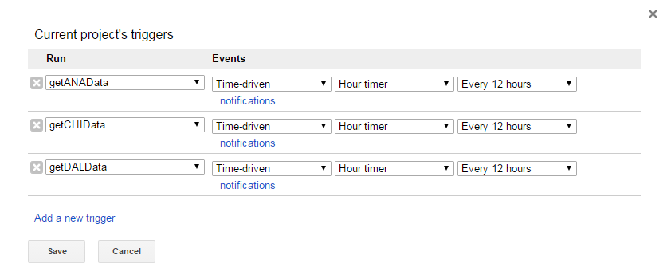
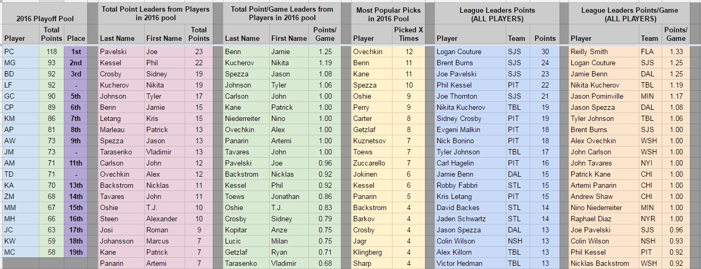

# NHL Player Pool
## Synopsis

This is a Google Sheet and script I made for a NHL Playoff Player Pool with my group of friends. Each person in our competition selected ten players that we thought would score the most points throughout the 2016 playoffs.

## Script Inputs

The [script] (AutoUpdateLinks.gs) fetches data using hyperlinks from each of the respective NHL teams playoff scoring websites.

Note that the original sheet used active links.  The active links are now broken, so I had to result to using the archived web pages.  Please let me know if links in the sheet are broken and I will work to update them.

## Motivation

The Google Sheet and script were created to decrease the maintenance of updating NHL player point totals after every playoff game.  As long as the NHL teams websites were updated, the points on the spreadsheet would be accurate. Seeing that we had 19 people in our gambling pool, it was much easier to automate this process.

Our competition worked by each person selecting ten NHL players that would be expected to score as many points as possible.  The top ten point scoring players of the regular season from each conference (western/eastern) were placed on lists.  You were only able to select two players from these lists.  The remaining players for your team had to be selected from the non-top-ten lists.

## Installation

View and/or download the [Google Sheet] (https://docs.google.com/spreadsheets/d/1PwCnH388o_6caZr4oDvbS9hlgQh15aneIsPeQer2qwM/edit#gid=1996471397) to see how the pool worked.

To add an auto-updating script: In Google Sheets, select Tools, then Script Editor.  To add an auto-updating feature, you will need to add 'triggers'.  Go to Edit, then All Your Triggers.  These triggers tell the spreadsheet to run the functions of your script at time intervals of your choice.  In this case, I updated the scores every 12 hours.

## Contributors

Michael Harris is the author of this sheet and script.

[StackOverflow] (http://stackoverflow.com/users/4530995/michael-harris)

[LinkedIN] (https://www.linkedin.com/in/michael-harris-366b0060/)

## License

This code is available under the [MIT License] (LICENSE).

